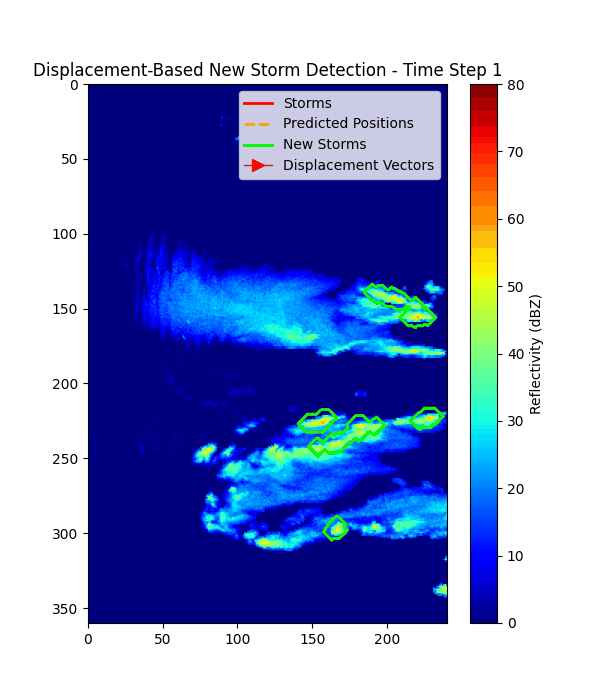

# Radar Precipitation Nowcasting Pipeline

This repository provides a pipeline for radar precipitation nowcasting of storm initiations using deep learning models. 

## Folder Structure

- `data/raw/` — Place your original raw radar data files here (`.h5` files). See [data/README.md](data/README.md). 
- `data/processed/` — Processed data files (e.g., `.npy`, `.json`) generated from raw data. Used as input for training. 
- `src/data/` — Data processing scripts. See [src/data/README.md](src/data/README.md).
- `src/models/` — Model architecture definitions. See [src/models/README.md](src/models/README.md).
- `src/training/` — Training scripts for different models. See [src/training/README.md](src/training/README.md).
- `src/utils/` — Utility scripts for evaluation and analysis. See [src/utils/README.md](src/utils/README.md).
- `experiments/runs/` — Each training run saves checkpoints, args, and results here.
- `experiments/wandb/` — [Weights & Biases](https://wandb.ai/) experiment logs (if enabled during training).

## Quickstart: End-to-End Example

1. **Prepare Data**
   - Place your raw `.h5` radar files in `data/raw/` (a small example dataset of one day is already provided).

2. **Process Data**
   - Step 1: Process raw data into intermediate chunks:
     ```bash
     python src/data/data_processing.py
     ```
   - Step 2: Join intermediate chunks into final training files:
     ```bash
     python src/data/join_processed_data.py
     ```
   - Step 3: Remove ground clutter from the dataset:
     ```bash
     python src/data/remove_ground_clutter.py
     ```

3. **Train a Model**
   - Train a UNet 3D CNN model on the processed example dataset:
     ```bash
     python src/training/train_unet_3D_cnn.py train \
       --save_dir experiments/runs/unet3dcnn_example \
       --base_ch 64 \
       --bottleneck_dims "(32,)" \
       --kernel_size 3 \
       --npy_path data/processed/ZH_radar_dataset.npy \
       --seq_len_in 10 \
       --seq_len_out 1 \
       --batch_size 4 \
       --epochs 15 \
       --device cpu \
       --loss_name weighted_mse \
       --train_val_test_split "(0.5,0.1,0.4)" \
       --early_stopping_patience 10 \
       --no_wandb
     ```
   - Arguments used for the run are saved as `args.json` in the run directory.

4. **Test a Model**
   - Run testing on the test set using the trained UNet 3D CNN model:
     ```bash
     python src/training/train_unet_3D_cnn.py test \
       --npy_path data/processed/ZH_radar_dataset.npy \
       --run_dir experiments/runs/unet3dcnn_example \
       --seq_len_in 10 \
       --seq_len_out 1 \
       --train_val_test_split "(0.5,0.1,0.4)" \
       --batch_size 4 \
       --base_ch 64 \
       --bottleneck_dims "(32,)" \
       --kernel_size 3 \
       --which best \
       --device cpu \
       --save_arrays True \
       --predictions_dir predictions/unet3dcnn_example
     ```
   - Large prediction/target files can be saved elsewhere using `--predictions_dir`.
   - Evaluation results are saved in `results/` inside the run directory.
   
5. **Evaluate Storm Initiation Predictions**
   - Use the storm_utils script to evaluate new storm initiations with displacement-based detection:
    ```bash
     python src/utils/storm_utils.py \
       --preds predictions/unet3dcnn_example/test_preds_dBZ.npy \
       --targets predictions/unet3dcnn_example/test_targets_dBZ.npy \
       --out experiments/runs/unet3dcnn_example/results/storm_eval.json \
       --reflectivity_threshold 45 \
       --area_threshold_km2 10.0 \
       --dilation_iterations 5 \
       --overlap_threshold 0.2 \
       --storm_tracking_overlap_threshold 0.2 \
       --use_displacement_prediction \
       --patch_size 32 \
       --patch_stride 16 \
       --patch_thresh 35 \
       --patch_frac 0.015 \
       --maxv 85.0 \
    ```
   - This will save a JSON file with evaluation metrics for storm initiations and forecasting performance.
   - The displacement-based detection accounts for storm movement caused by wind/advection to reduce false positive new storm detections.
   - Displacement vectors are only computed on patches with sufficient high-reflectivity pixels.
   - Use `--no_displacement_prediction` for basic overlap tracking without displacement calculation.

6. **Track Experiments**
   - If using Weights & Biases, logs are saved in `experiments/wandb/`.

## Evaluations 

### **Storm Initiation**
- *Displacement-Based Detection*: Uses cross-correlation to estimate displacement caused by wind/advection and predict storm positions
- *Physical Area Calculations*: Storm area measurement in km² accounting for polar coordinate geometry
- *Storm Initiation Metrics*: Evaluates correct, early, late, and false positive storm initiations

### **Forecasting Performance Metrics**
Forecasting evaluation:
- *B-MSE (Balanced Mean Squared Error)*: Weighted error metric for different reflectivity ranges
- *CSI (Critical Success Index)*: For thresholds [2, 5, 10, 30, 45] dBZ
- *HSS (Heidke Skill Score)*: For thresholds [2, 5, 10, 30, 45] dBZ

### **Visualizations**
#### True vs Predicted Storms

#### Storms with Displacement (Accounting for Wind)


